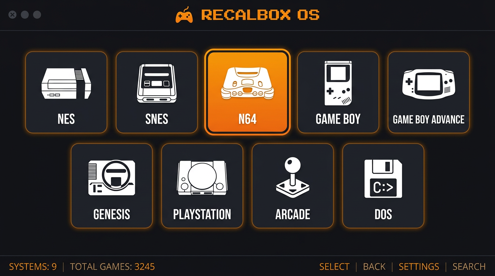
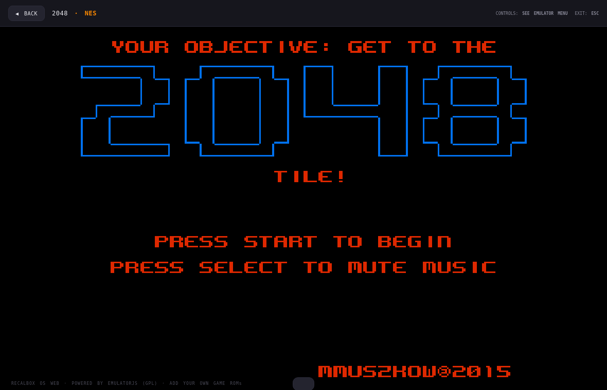

<div align="center">

# 🕹️ RECALBOX OS WEB

**Multi-system retro gaming desktop app** — plays games for **26 retro systems** in a Recalbox-style frontend that runs as a normal application. **No operating system to install or boot.**



[](#-supported-systems)
[](#-licenses)
[](https://github.com/Mylittlestories/recalbox-os-web/releases)

</div>

## 📥 Download & Install

**Get the latest installer for your platform from the [Releases page](https://github.com/Mylittlestories/recalbox-os-web/releases):**

| Platform | File | Type |
|----------|------|------|
| 🪟 Windows | `Recalbox.OS.Web.Setup.1.0.0.exe` | Installer |
| 🪟 Windows | `Recalbox.OS.Web.1.0.0.exe` | Portable (no install) |
| 🐧 Linux | `Recalbox.OS.Web-1.0.0.AppImage` | AppImage |
| 🍎 macOS | `Recalbox.OS.Web-1.0.0.dmg` | Disk image |

<div align="center">

<a href="https://github.com/Mylittlestories/recalbox-os-web/releases/latest">
  
</a>

</div>

> **No Node.js needed** — the [GitHub Actions build](#-cloud-build-option-b) compiles the installers in the cloud automatically. Just download and run.

## 🎮 In Action



## 🖥️ Supported systems

| System | Core |
|--------|------|
| Nintendo NES | fceumm / nestopia |
| Super Nintendo (SNES) | snes9x |
| Nintendo 64 | mupen64plus_next |
| Game Boy / Game Boy Color | gambatte |
| Game Boy Advance | mgba |
| Nintendo DS | melonds |
| Sony PlayStation | pcsx_rearmed |
| PlayStation Portable | ppsspp |
| Sega Genesis / Mega Drive | genesis_plus_gx |
| Sega Master System | smsplus |
| Sega Game Gear | genesis_plus_gx |
| Sega CD | genesis_plus_gx |
| Sega Saturn | yabause |
| Atari 2600 / 5200 / 7800 | stella2014 / a5200 / prosystem |
| Atari Lynx | handy |
| Atari Jaguar | virtualjaguar |
| PC Engine | mednafen_pce |
| WonderSwan | mednafen_wswan |
| Neo Geo Pocket | mednafen_ngp |
| Commodore 64 | vice_x64sc |
| Commodore Amiga | puae |
| Arcade (FBNeo) | fbneo |
| MAME 2003+ | mame2003_plus |
| MS-DOS (DOSBox) | dosbox_pure |

## ⚠️ Important note about game ROMs

The app provides the **emulator engines** (open source, GPL). It does **not** include
copyrighted games. You add your own ROMs in the app (`ADD ROM` or drag-and-drop).
A few systems (PS1, Sega CD, etc.) may require **BIOS files** that you supply yourself.

A bundled **free** demo game is included: **2048** for NES (homebrew).

## 🛠️ Run locally (development)

```bash
npm install
npm run cores          # download the emulator cores (only needed once)
npm start              # launch the app window
```

## 📦 Build installers locally

```bash
npm install
npm run cores
npx electron-builder --win     # Windows .exe (needs Windows, or Wine on Linux)
npx electron-builder --linux   # Linux AppImage
npx electron-builder --mac     # macOS .dmg (needs macOS)
```

Output goes into `dist/`.

## ☁️ Cloud build (Option B)

Push this repo to GitHub, then either push a tag (`v1.0.0`) or run the
**"Build Recalbox OS Web"** workflow from the Actions tab. GitHub Actions:

1. checks out the code,
2. downloads all emulator cores,
3. builds Windows (`.exe`), Linux (`.AppImage`) and macOS (`.dmg`) installers,
4. uploads them as workflow artifacts — and on a version tag, attaches them to a
   **GitHub Release** so you can download ready-made installers.

## 📂 Project layout

```
main.js                 Electron main (custom app:// protocol, offline EmulatorJS)
www/                    the app (frontend + EmulatorJS data)
  index.html            UI
  js/app.js             frontend logic
  css/                  theme + font
  img/                  screenshots for this README
  data/                 EmulatorJS framework + cores (from `npm run cores`)
  roms/                 bundled free demo games
build/icon.png          app icon
scripts/download-cores.js   fetches all emulator cores
.github/workflows/build.yml  GitHub Actions cloud build
```

## 📄 Licenses

- EmulatorJS and its RetroArch cores are **GPL-3.0**.
- This app is provided for playing games you own. Always respect copyright.
