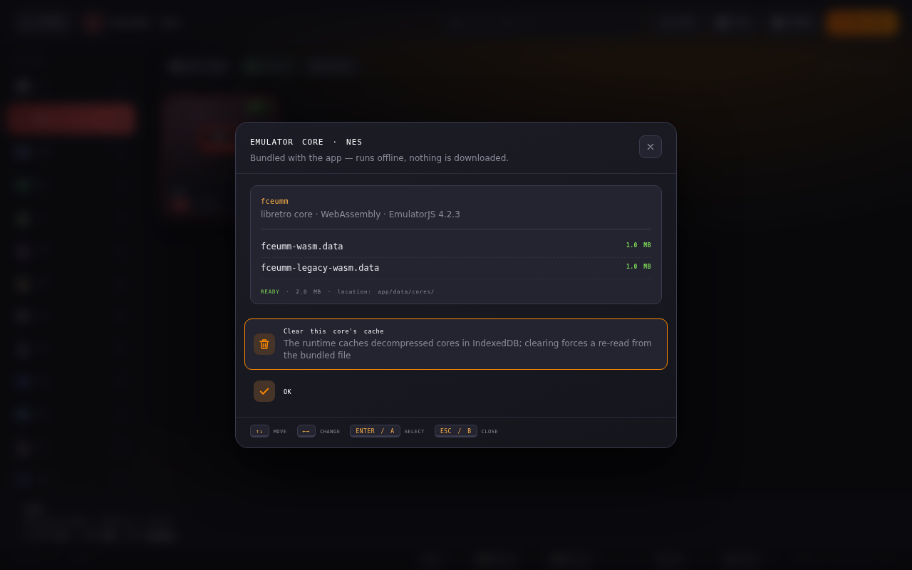
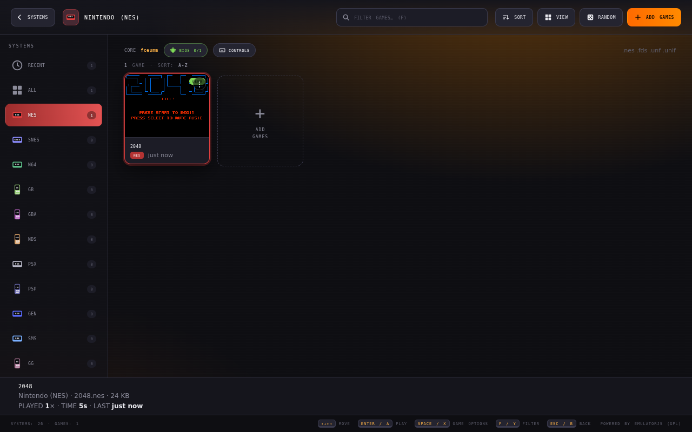
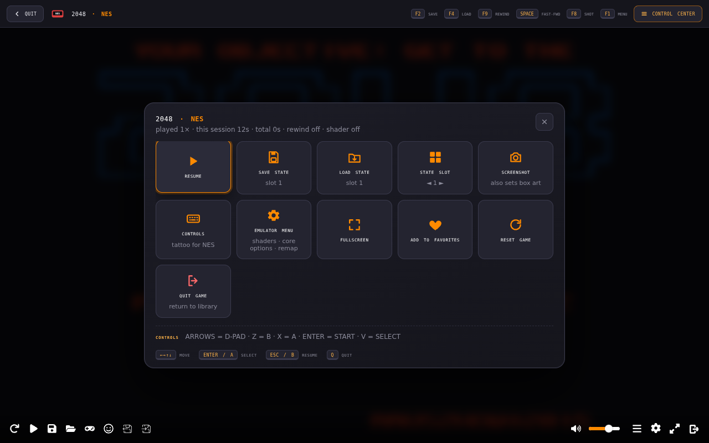
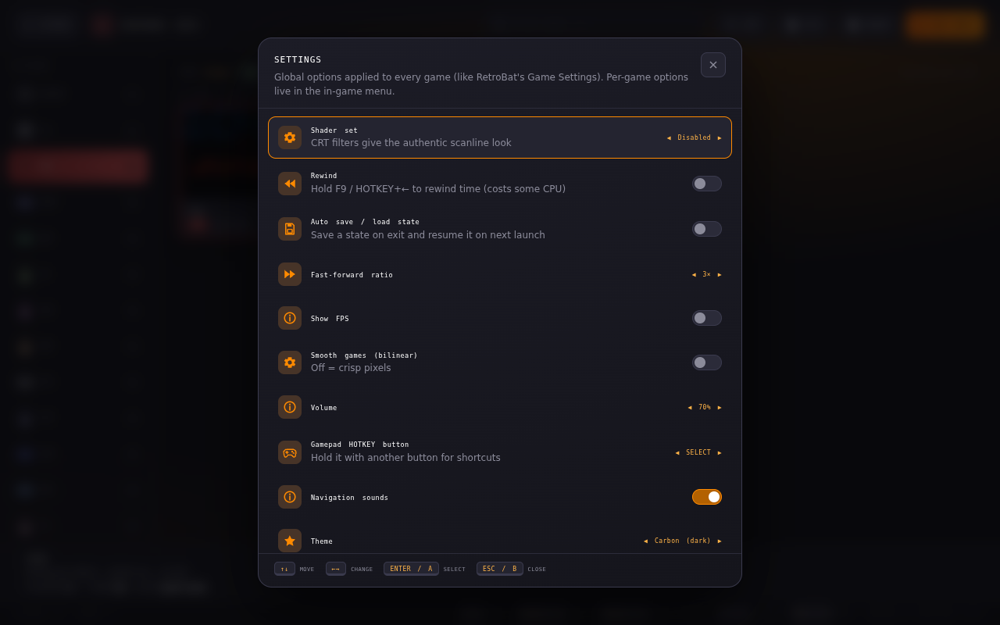
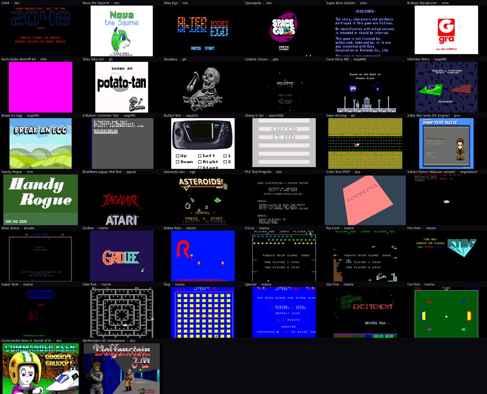

<div align="center">

# 🕹️ RECALBOX OS WEB

**Standalone multi-system retro gaming desktop app** — plays games for **26 retro systems** in a Recalbox / RetroBat-style frontend that runs as a normal application. **No operating system to install, no internet connection needed: every emulator is bundled inside the app.**


[](#-supported-systems)
[](#-standalone--offline-by-design)
[](#-licenses)
[](https://github.com/Mylittlestories/recalbox-os-web/releases)

</div>

## 📥 Download & Install

**Get the latest installer for your platform from the [Releases page](https://github.com/Mylittlestories/recalbox-os-web/releases):**

| Platform | File | Type |
|----------|------|------|
| 🪟 Windows | `Recalbox.OS.Web.Setup.2.2.0.exe` | Installer |
| 🪟 Windows | `Recalbox.OS.Web.2.2.0.exe` | Portable (no install) |
| 🐧 Linux | `Recalbox.OS.Web-2.2.0.AppImage` | AppImage |
| 🍎 macOS | `Recalbox.OS.Web-2.2.0.dmg` | Disk image |

<div align="center">

<a href="https://github.com/Mylittlestories/recalbox-os-web/releases/latest">
  
</a>

</div>

> **No Node.js needed** — the [GitHub Actions build](#️-cloud-build-option-b) compiles the installers in the cloud automatically. Just download and run.

## 🔌 Standalone — offline by design

Like **RetroArch** or **RetroPie**, the emulators are *part of the application*:

- **All 25 emulator cores are bundled** in the installer (`www/data/cores/`, ~92 MB) — RetroArch/libretro cores compiled to WebAssembly by the [EmulatorJS](https://emulatorjs.org) project (fceumm, snes9x, mupen64plus-next, pcsx-rearmed, ppsspp, genesis-plus-gx, fbneo, mame2003-plus, dosbox-pure…). They are pinned to the **exact runtime version** shipped in the app, so nothing can drift.
- **Nothing is downloaded at runtime.** The Electron shell blocks every network request that is not the app's own `app://` scheme (plus a strict Content-Security-Policy), and the frontend neutralises the two places where the emulator runtime would otherwise reach its CDN (update check, core "failsafe" download). Disconnect the cable, put the PC in a cupboard — it works.
- **Visible in the UI:** the boot screen reports `loading emulators ..... 25/25 cores · 92 MB · offline ready`, **Settings → Emulators** lists every core with its size, and the **CORE** chip in each system's library opens the core details. If a build ever lacked a core, that system is flagged `CORE MISSING` and its games are not launched (instead of a silent download attempt).
- **Guaranteed by the build:** `npm run dist` and the GitHub workflow refuse to package an incomplete core set (`npm run cores:check`).

Your games, BIOS, save states and settings are stored locally too — nothing ever leaves your machine.



## ✨ What's new in 2.0 — the RetroBat treatment

Version 2.0 rebuilds the frontend around the ideas that make [RetroBat](https://www.retrobat.org/) / EmulationStation pleasant to use with a controller from the couch:

| Area | What you get |
|------|--------------|
| **Persistent library** | Games you add are stored *inside the app* (IndexedDB) and survive restarts. Drop files **anywhere** in the window, multi-select, and the system is detected from the extension. `.cue` + `.bin` discs are packed together automatically. |
| **Collections** | **Recently played**, **Favorites** and **All games** appear next to the systems, with per-system game counts. Systems without games can be hidden. |
| **Full controller & keyboard navigation** | D-pad / left stick to move, **A** open · **B** back · **X** game options · **Y** search · **START** settings · **L1/R1** switch system. Every screen shows its button hints. |
| **Game view** | Type-to-filter, sort (A-Z / last played / date added / most played / system), grid or list view, random game, jump-to-letter, favorites on top, box art from your last screenshot, play count & play time. |
| **Game options** | Long-press / right-click / **SPACE**: play, favorite, rename, move to another system, clear saves, delete. |
| **RetroBat hotkeys in game** | F2 save · F4 load · F6/F7 slot · F8 screenshot · F9 rewind · SPACE fast-forward · P pause · F11 fullscreen · **CTRL+F12 Game Control Center** · ESC quit — and the same with **HOTKEY + button** on a gamepad (see table below). |
| **Game Control Center** | An in-game overlay: resume, save/load with slot picker, screenshot, controls "tattoo", emulator menu, fullscreen, favorite, reset, quit. The game is paused while it's open. |
| **Save states that stick** | 9 slots per game stored in the app, with **Auto save / load** ("resume where you left"). |
| **BIOS manager** | Per-system BIOS list with required/optional flags, one-click install, **missing BIOS check** before launch (like RetroBat). |
| **Settings** | Shader set (CRT etc.), rewind, fast-forward ratio, FPS counter, smooth/bilinear, volume, gamepad HOTKEY button, navigation sounds, 3 themes, kid mode, hide empty systems, storage report, library export. |
| **Controls tattoo** | The first time you play a system you get its default layout; it's always one press away (CONTROLS button / control center). |

## 🎮 In Action







## ⌨️ Controls & hotkeys

### Menus

| Action | Keyboard | Gamepad |
|--------|----------|---------|
| Move | Arrows | D-pad / left stick |
| Open / Play | `Enter` | **A** |
| Back | `Esc` / `Backspace` | **B** |
| Game options | `Space` / right-click | **X** |
| Search / filter | `F` | **Y** |
| Settings | `S` | **START** |
| View options (sort, view style, random…) | `O` sort · `V` view · `R` random | **SELECT** |
| Previous / next system (game view) | `PgUp` / `PgDn` | **L1 / R1** |
| Add games | `A` / `Insert` | — |
| Help | `H` | — |

### In game (RetroBat layout)

| Action | Keyboard | Gamepad (hold **HOTKEY**, default SELECT) |
|--------|----------|-------------------------------------------|
| Game Control Center | `Ctrl+F12` | HOTKEY + **B** |
| Quit game | `Esc` | HOTKEY + **START** |
| Emulator menu (shaders, remap, core options) | `F1` | HOTKEY + **L1** |
| Save state | `F2` | HOTKEY + **Y** |
| Load state | `F4` | HOTKEY + **X** |
| State slot − / + | `F6` / `F7` | HOTKEY + **D-pad ↓ / ↑** |
| Screenshot (also becomes box art) | `F8` | HOTKEY + **R3** |
| Rewind (hold; enable in Settings) | `F9` | HOTKEY + **D-pad ←** |
| Fast-forward (hold) | `Space` (`F10` on computer systems) | HOTKEY + **D-pad →** |
| Pause | `P` (not on computer systems) | HOTKEY + **A** |
| Fullscreen | `F11` | — |

Default game keys: **Arrows** = D-pad · **Z** = B/1 · **X** = A/2 · **A** = Y/3 · **S** = X/4 · **Enter** = START · **V** = SELECT · **Q/E** = L/R. Any standard gamepad works out of the box; remap in the emulator menu (`F1` → Control Settings).

## 🖥️ Supported systems

| System | Core | BIOS |
|--------|------|------|
| Nintendo NES / Famicom Disk System | fceumm | `disksys.rom` (FDS only) |
| Super Nintendo (SNES) | snes9x | — |
| Nintendo 64 | mupen64plus_next | — |
| Game Boy / Game Boy Color | gambatte | — |
| Game Boy Advance | mgba | optional `gba_bios.bin` |
| Nintendo DS | melonds | optional `bios7.bin`, `bios9.bin`, `firmware.bin` |
| Sony PlayStation | pcsx_rearmed | **`scph5501.bin`** (or 5500 / 5502 / 1001) |
| PlayStation Portable | ppsspp | — |
| Sega Genesis / Mega Drive | genesis_plus_gx | — |
| Sega Master System | smsplus | — |
| Sega Game Gear | genesis_plus_gx | — |
| Sega CD | genesis_plus_gx | **`bios_CD_U.bin`** / E / J |
| Sega Saturn | yabause | **`saturn_bios.bin`** |
| Atari 2600 / 5200 / 7800 | stella2014 / a5200 / prosystem | optional `5200.rom`, `7800 BIOS (U).rom` |
| Atari Lynx | handy | **`lynxboot.img`** |
| Atari Jaguar | virtualjaguar | — |
| PC Engine / TurboGrafx-16 | mednafen_pce | `syscard3.pce` (CD games) |
| WonderSwan / Color | mednafen_wswan | — |
| Neo Geo Pocket / Color | mednafen_ngp | — |
| Commodore 64 | vice_x64sc | — |
| Commodore Amiga | puae | **`kick34005.A500`** (Kickstart) |
| Arcade (FBNeo) | fbneo | `neogeo.zip` for Neo Geo games |
| MAME 2003 Plus | mame2003_plus | `neogeo.zip` for Neo Geo games |
| MS-DOS (DOSBox Pure) | dosbox_pure | — |

Bold = required. Install BIOS files from the **BIOS** button in a system's game view, or run **Settings → Missing BIOS check**.

## 🎁 Bundled free games — try every system out of the box

The app ships with a **free library of 38 games covering 20 of the 26 systems** — homebrew, open-source and freeware
titles released by their authors, plus the classic arcade games that their rights holders made available for free
non-commercial use. Every one of them was launched on its bundled core (see `www/roms/LICENSES.md` for the exact terms,
authors and the compatibility notes). They appear with a **FREE** badge, cannot be deleted (hide the system instead) and
have full attributes: press **I** (or *Game options → Game info*) on a game to see author, year, genre, players, licence,
source URL, file size, play stats and its box art.



| System | Game | Author | Year | Licence |
|--------|------|--------|------|---------|
| NES | **2048** | tsone | 2014 | MIT / open source |
| NES | **Nova the Squirrel** | NovaSquirrel | 2018 | GPL-3.0 (code) · CC BY-NC-SA 4.0 (assets) |
| NES | **Alter Ego** | Shiru | 2011 | Freeware / public domain |
| NES | **Spacegulls** | Morphcat Games | 2021 | Freeware |
| SNES | **Super Boss Gaiden** | Dieter von Laser / Chilly Willy | 2015 | Freeware |
| SNES | **N-Warp Daisakusen** | d4s | 2008 | Freeware |
| Nintendo 64 | **Kumi-Daiko Beatoff 64** | Team Riistahillo (N64brew Game Jam 2020) | 2020 | CC0 1.0 (public domain dedication) |
| Game Boy | **Tobu Tobu Girl** | Tangram Games | 2017 | MIT / CC BY 4.0 (open source) |
| Game Boy | **Deadeus** | -IZMA- | 2019 | Freeware |
| Game Boy Advance | **Celeste Classic** | Maddy Thorson & Noel Berry · GBA port by JeffRuLz | 2020 | Open source (original PICO-8 game, free) |
| Mega Drive | **Cave Story MD** | Studio Pixel · port by andwn | 2019 | MIT (port) · freeware (game) |
| Mega Drive | **Ultimate Tetris** | Haroldo O. Pinheiro | 2021 | Freeware / open source (SGDK) |
| Mega Drive | **Break An Egg** | Studio Vetea | 2017 | Freeware |
| Master System | **6-Button Controller Test** | Charles MacDonald | 2000 | Public domain |
| Game Gear | **Button Test** | libretro | 2019 | Public domain |
| Atari 2600 | **Sheep It Up!** | Dr. Ludos | 2017 | Freeware (open source) |
| WonderSwan | **Swan Driving** | Sebastian Mihai | 2012 | Freeware |
| PC Engine | **240p Test Suite (PC Engine)** | Artemio Urbina | 2013 | GPLv2 |
| Atari Lynx | **Handy Rogue** | james7780 | 2024 | Open source (GitHub) |
| Atari Jaguar | **BlueRetro Jaguar Pad Test** | Jacques Gagnon (darthcloud) | 2021 | Apache-2.0 |
| Neo Geo Pocket | **Asteroids neo** | Steven MacDonald (studioNOTsnk) | 2026 | MIT |
| PlayStation | **PSX Test Program** | libretro | 2019 | Open source |
| PSP | **Cube Test (PSP)** | PPSSPP | 2019 | Open source |
| Sega Saturn | **Saturn Demo (Yabause sample)** | Yabause project | 2012 | GPL |
| Arcade (FBNeo) | **Alien Arena** | Duncan Brown | 1985 | Free for home use (author's permission) |
| MAME 2003-Plus | **Gridlee** | Videa | 1982 | Free non-commercial use (Videa founders) |
| MAME 2003-Plus | **Robby Roto** | Bally/Midway | 1981 | Free non-commercial use (Jamie Fenton) |
| MAME 2003-Plus | **Circus** | Exidy | 1977 | Free non-commercial use (Exidy) |
| MAME 2003-Plus | **Rip Cord** | Exidy | 1979 | Free non-commercial use (Exidy) |
| MAME 2003-Plus | **Fire One!** | Exidy | 1979 | Free non-commercial use (Exidy) |
| MAME 2003-Plus | **Super Tank** | Video Games GmbH | 1981 | Free non-commercial use |
| MAME 2003-Plus | **Side Trak** | Exidy | 1979 | Free non-commercial use (Exidy) |
| MAME 2003-Plus | **Targ** | Exidy | 1980 | Free non-commercial use (Exidy) |
| MAME 2003-Plus | **Spectar** | Exidy | 1980 | Free non-commercial use (Exidy) |
| MAME 2003-Plus | **Star Fire** | Exidy | 1979 | Free non-commercial use (Exidy) |
| MAME 2003-Plus | **Car Polo** | Exidy | 1977 | Free non-commercial use (Exidy) |
| MS-DOS | **Commander Keen 4: Secret of the Oracle (shareware)** | id Software / Apogee | 1991 | Shareware episode (freely distributable) |
| MS-DOS | **Wolfenstein 3D (shareware)** | id Software / Apogee | 1992 | Shareware episode (freely distributable) |

Systems with no legally free game we could find in a working form (Nintendo DS, Sega CD, Atari 5200 / 7800, C64, Amiga) start
empty — add your own files.

The **MAME / FBNeo arcade titles** (Exidy, Bally/Midway, Videa, Video Games GmbH, Duncan Brown) are approved for distribution on
[mamedev.org](https://www.mamedev.org/roms/) only, so they are **not in this repository**: `npm run roms`
(`scripts/download-roms.js`) fetches and checksums them at build time, exactly like the emulator cores, and the GitHub build
does the same. If a file is missing the game is simply not listed.

## ⚠️ Important note about game ROMs

The app provides the **emulator engines** (open source, GPL) and the free library above. It does **not** include
copyrighted commercial games. You add your own ROMs in the app (**ADD GAMES** or drag-and-drop);
they are stored inside the app's local database, never uploaded anywhere.
A few systems (PS1, Sega CD, Saturn, Lynx, Amiga…) require **BIOS files** that you supply yourself.

## 🛠️ Run locally (development)

```bash
npm install
npm run cores          # bundle the emulator cores into www/data/cores (internet needed ONCE, ~92 MB)
npm run roms           # fetch the mamedev.org arcade games into www/roms (internet needed ONCE, ~170 KB)
npm start              # launch the app window — works offline from now on
npm run cores:check    # verify the core bundle is complete without touching the network
npm run roms:check     # same for the arcade games
```

`npm start` also runs the core script in "soft" mode: if something is missing and you are online it
completes the set, if you are offline it simply starts the app with what is there.

Tip: the frontend is plain HTML/CSS/JS in `www/` — you can also serve that folder with any static
server that sends `Cross-Origin-Opener-Policy: same-origin` and `Cross-Origin-Embedder-Policy: require-corp`
headers and open it in Chrome for quick UI work.

## 📦 Build installers locally

```bash
npm install
npm run cores
npm run dist -- --win     # Windows .exe (needs Windows, or Wine on Linux)
npm run dist -- --linux   # Linux AppImage
npm run dist -- --mac     # macOS .dmg (needs macOS)
```

Output goes into `dist/`. The cores are packaged **inside** the installer (unpacked next to the
asar archive so the emulator can stream them); `predist` aborts the build if any core is missing.

## ☁️ Cloud build (Option B)

Push this repo to GitHub, then either push a tag (`v2.2.0`) or run the
**"Build Recalbox OS Web"** workflow from the Actions tab. GitHub Actions:

1. checks out the code,
2. bundles all emulator cores (cached between runs, verified for completeness),
3. builds Windows (`.exe`), Linux (`.AppImage`) and macOS (`.dmg`) installers,
4. uploads them as workflow artifacts — and on a version tag, attaches them to a
   **GitHub Release** so you can download ready-made installers.

## 📂 Project layout

```
main.js                 Electron main (app:// protocol with COOP/COEP + CSP, network lockdown, core inventory)
www/                    the app (frontend + EmulatorJS data)
  index.html            UI: boot · system view · game view · player · control center · dialogs
  js/app.js             frontend logic (library DB, navigation, hotkeys, settings, BIOS manager)
  css/                  theme + font
  img/                  screenshots for this README
  data/                 EmulatorJS 4.2.3 runtime (stable release)
  data/cores/           bundled emulator cores + manifest.json (from `npm run cores`, not in git)
  roms/                 bundled free library: games + library.json (attributes) + LICENSES.md (credits)
build/icon.png          app icon
scripts/download-cores.js   bundles/verifies the emulator cores (pinned to the runtime version)
scripts/download-roms.js    fetches/verifies the mamedev.org arcade games (distribution restricted to that site)
.github/workflows/build.yml  GitHub Actions cloud build
```

Where things are stored on your machine (all local): games, BIOS and box art in the app's
IndexedDB (`recalbox-web`), save states in `EmulatorJS-states`, in-game saves (SRAM / memory cards)
in the emulator's IDBFS, settings in `localStorage`.

## 📄 Licenses

- EmulatorJS and its RetroArch cores are **GPL-3.0**.
- The bundled games belong to their authors — see [`www/roms/LICENSES.md`](www/roms/LICENSES.md) for each title's licence
  (GPL, MIT, CC0, Apache-2.0, freeware, shareware episodes, mamedev.org free non-commercial use).
- This app is provided for playing games you own. Always respect copyright.
